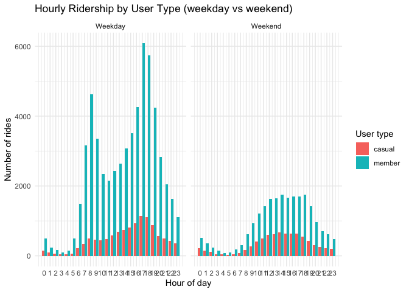
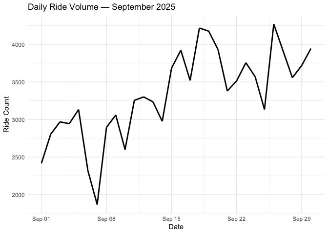

EDA
================
Zihan Zhou
2025-11-25

Library key packages and load data.

``` r
library(tidyverse)
```

    ## ── Attaching core tidyverse packages ──────────────────────── tidyverse 2.0.0 ──
    ## ✔ dplyr     1.1.4     ✔ readr     2.1.5
    ## ✔ forcats   1.0.0     ✔ stringr   1.6.0
    ## ✔ ggplot2   4.0.0     ✔ tibble    3.3.0
    ## ✔ lubridate 1.9.4     ✔ tidyr     1.3.1
    ## ✔ purrr     1.2.0     
    ## ── Conflicts ────────────────────────────────────────── tidyverse_conflicts() ──
    ## ✖ dplyr::filter() masks stats::filter()
    ## ✖ dplyr::lag()    masks stats::lag()
    ## ℹ Use the conflicted package (<http://conflicted.r-lib.org/>) to force all conflicts to become errors

``` r
library(lubridate)
library(patchwork)
library(scales)
```

    ## 
    ## Attaching package: 'scales'
    ## 
    ## The following object is masked from 'package:purrr':
    ## 
    ##     discard
    ## 
    ## The following object is masked from 'package:readr':
    ## 
    ##     col_factor

``` r
library(knitr)

bike <- read_csv("data/final_bike_weather_categorized.csv")
```

    ## Warning: One or more parsing issues, call `problems()` on your data frame for details,
    ## e.g.:
    ##   dat <- vroom(...)
    ##   problems(dat)

    ## Rows: 100000 Columns: 28
    ## ── Column specification ────────────────────────────────────────────────────────
    ## Delimiter: ","
    ## chr  (10): ride_id, rideable_type, start_station_name, start_station_id, end...
    ## dbl  (13): end_station_id, start_lat, start_lng, end_lat, end_lng, start_mon...
    ## dttm  (4): started_at, ended_at, datetime_start_obj, datetime_end_obj
    ## date  (1): start_date
    ## 
    ## ℹ Use `spec()` to retrieve the full column specification for this data.
    ## ℹ Specify the column types or set `show_col_types = FALSE` to quiet this message.

``` r
glimpse(bike)
```

    ## Rows: 100,000
    ## Columns: 28
    ## $ ride_id             <chr> "761B30A5B7B64236", "FBEA1249070FDC8C", "91A501973…
    ## $ rideable_type       <chr> "electric_bike", "electric_bike", "classic_bike", …
    ## $ started_at          <dttm> 2025-09-01 11:38:30, 2025-09-01 19:38:52, 2025-09…
    ## $ ended_at            <dttm> 2025-09-01 11:42:08, 2025-09-01 19:46:19, 2025-09…
    ## $ start_station_name  <chr> "5 Ave & E 30 St", "W 74 St & Columbus Ave", "Cumb…
    ## $ start_station_id    <chr> "6248.08", "7230.10", "4428.02", "4467.03", "5329.…
    ## $ end_station_name    <chr> "8 Ave & W 31 St", "3 Ave & E 72 St", "Lafayette A…
    ## $ end_station_id      <dbl> 6450.05, 7028.04, 4470.09, 4122.03, 5989.02, 4231.…
    ## $ start_lat           <dbl> 40.74598, 40.77857, 40.68753, 40.68672, 40.71755, …
    ## $ start_lng           <dbl> -73.98629, -73.97755, -73.97265, -73.93899, -74.01…
    ## $ end_lat             <dbl> 40.75059, 40.76994, 40.68700, 40.67686, 40.73805, …
    ## $ end_lng             <dbl> -73.99468, -73.96061, -73.97665, -73.93607, -73.99…
    ## $ member_casual       <chr> "casual", "casual", "member", "casual", "casual", …
    ## $ datetime_start_obj  <dttm> 2025-09-01 11:38:30, 2025-09-01 19:38:52, 2025-09…
    ## $ datetime_end_obj    <dttm> 2025-09-01 11:42:08, 2025-09-01 19:46:19, 2025-09…
    ## $ start_month         <dbl> 9, 9, 9, 9, 9, 9, 9, 9, 9, 9, 9, 9, 9, 9, 9, 9, 9,…
    ## $ start_day           <dbl> 1, 1, 1, 1, 1, 1, 1, 1, 1, 1, 1, 1, 1, 1, 1, 1, 1,…
    ## $ ride_duration_hours <dbl> 0.06069722, 0.12432833, 0.04609028, 0.19654083, 0.…
    ## $ distance_km         <dbl> 0.8734433, 1.7209451, 0.3426126, 1.1251295, 2.6857…
    ## $ bearing_degrees     <dbl> -54.20579, 123.80039, -99.91008, 167.30502, 31.924…
    ## $ start_date          <date> 2025-09-01, 2025-09-01, 2025-09-01, 2025-09-01, 2…
    ## $ tmax                <dbl> 78, 78, 78, 78, 78, 78, 78, 78, 78, 78, 78, 78, 78…
    ## $ tmin                <dbl> 64, 64, 64, 64, 64, 64, 64, 64, 64, 64, 64, 64, 64…
    ## $ prcp                <dbl> 0, 0, 0, 0, 0, 0, 0, 0, 0, 0, 0, 0, 0, 0, 0, 0, 0,…
    ## $ temp_diff_category  <chr> "Medium", "Medium", "Medium", "Medium", "Medium", …
    ## $ temp_level_category <chr> "Low", "Low", "Low", "Low", "Low", "Low", "Low", "…
    ## $ rain_category       <chr> "No Rain", "No Rain", "No Rain", "No Rain", "No Ra…
    ## $ weekend_and_holiday <chr> "weekend and holiday", "weekend and holiday", "wee…

# 1. Overview

This part analyzes temporal ridership patterns and weather effects for
Citi Bike trips in September 2025.

``` r
if ("datetime_start_obj" %in% names(bike) && !all(is.na(bike$datetime_start_obj))) {
  bike <- bike %>%
  mutate(datetime_start = ymd_hms(datetime_start_obj, quiet = TRUE))
} else {
  bike <- bike %>% mutate(datetime_start = ymd_hms(started_at, quiet = TRUE))
}

bike <- bike %>%
  mutate(
  date = as.Date(datetime_start),
  hour = hour(datetime_start),
  wday = wday(datetime_start, label = TRUE, week_start = 1), # Mon-Sun labels
  weekday_weekend = case_when(
  weekend_and_holiday %in% c("weekend", "weekend and holiday", "Weekend", "weekend and holiday") ~ "Weekend", TRUE ~ "Weekday"),
  user_type = member_casual
)
```

# 2. Hourly patterns by user type

``` r
hourly <- bike %>%
  filter(!is.na(hour)) %>%
  group_by(hour, user_type, weekday_weekend) %>%
  summarise(rides = n(), .groups = "drop")

p_hour_facet <- hourly %>%
  ggplot(aes(x = hour, y = rides, fill = user_type)) +
  geom_col(position = "dodge") +
  facet_wrap(~ weekday_weekend, nrow = 1) +
  scale_x_continuous(breaks = 0:23) +
  labs(title = "Hourly Ridership by User Type (weekday vs weekend)", x = "Hour of day", y = "Number of rides", fill = "User type") +
  theme_minimal()

p_hour_facet
```

<!-- -->

From the plot, the number of members is larger than the number of casual
users, which means most of the users are members. Compared to weekend,
weekday has a higher proportion of members, showing that people who need
weekly commute are more likely to be a member.

In addition, the morning and evening peak hours are more pronounced
among members, characterized by a bimodal distribution during 7~8 a.m.
and 5~6 p.m. on weekdays.

# 3. Day-of-week patterns

``` r
wday_daily <- bike %>%
  group_by(wday, user_type) %>%
  summarise(rides = n(), .groups = "drop") %>%
  mutate(wday = factor(wday, levels = c("Mon","Tue","Wed","Thu","Fri","Sat","Sun")))

p_wday <- ggplot(wday_daily, aes(x = wday, y = rides, fill = user_type)) +
  geom_col(position = "dodge") +
  labs(title = "Ridership by Day of Week (member vs casual)",
       x = "Day of Week", y = "Ride Count", fill = "User Type") +
  theme_minimal()

p_wday
```

<!-- -->

As shown in the bar chart, it is clear that member users have much
higher ride counts than casual users.

Specifically, member ride counts are particularly high on Mondays and
Tuesdays and reach their lowest on weekends.

In contrast, casual users’ ride counts are relatively consistent
throughout the week, with slightly higher numbers on weekends. The
observation confirms the previous conclusion.
