EDA
================
Zihan Zhou
2025-11-25

Library key packages and load data.

``` r
library(tidyverse)
```

    ## ── Attaching core tidyverse packages ──────────────────────── tidyverse 2.0.0 ──
    ## ✔ dplyr     1.1.4     ✔ readr     2.1.5
    ## ✔ forcats   1.0.0     ✔ stringr   1.6.0
    ## ✔ ggplot2   4.0.0     ✔ tibble    3.3.0
    ## ✔ lubridate 1.9.4     ✔ tidyr     1.3.1
    ## ✔ purrr     1.2.0     
    ## ── Conflicts ────────────────────────────────────────── tidyverse_conflicts() ──
    ## ✖ dplyr::filter() masks stats::filter()
    ## ✖ dplyr::lag()    masks stats::lag()
    ## ℹ Use the conflicted package (<http://conflicted.r-lib.org/>) to force all conflicts to become errors

``` r
library(lubridate)
library(ggplot2)
library(gridExtra)
```

    ## 
    ## Attaching package: 'gridExtra'
    ## 
    ## The following object is masked from 'package:dplyr':
    ## 
    ##     combine

``` r
library(tsibble)
```

    ## Registered S3 method overwritten by 'tsibble':
    ##   method               from 
    ##   as_tibble.grouped_df dplyr
    ## 
    ## Attaching package: 'tsibble'
    ## 
    ## The following object is masked from 'package:lubridate':
    ## 
    ##     interval
    ## 
    ## The following objects are masked from 'package:base':
    ## 
    ##     intersect, setdiff, union

``` r
library(feasts)
```

    ## Loading required package: fabletools

``` r
library(patchwork)
library(scales)
```

    ## 
    ## Attaching package: 'scales'
    ## 
    ## The following object is masked from 'package:purrr':
    ## 
    ##     discard
    ## 
    ## The following object is masked from 'package:readr':
    ## 
    ##     col_factor

``` r
library(knitr)
library(broom)
library(forecast)
```

    ## Registered S3 method overwritten by 'quantmod':
    ##   method            from
    ##   as.zoo.data.frame zoo

``` r
bike <- read_csv("data/final_bike_weather_categorized.csv")
```

    ## Rows: 99986 Columns: 28
    ## ── Column specification ────────────────────────────────────────────────────────
    ## Delimiter: ","
    ## chr  (11): ride_id, rideable_type, start_station_name, start_station_id, end...
    ## dbl  (12): start_lat, start_lng, end_lat, end_lng, start_month, start_day, r...
    ## dttm  (4): started_at, ended_at, datetime_start_obj, datetime_end_obj
    ## date  (1): start_date
    ## 
    ## ℹ Use `spec()` to retrieve the full column specification for this data.
    ## ℹ Specify the column types or set `show_col_types = FALSE` to quiet this message.

``` r
glimpse(bike)
```

    ## Rows: 99,986
    ## Columns: 28
    ## $ ride_id             <chr> "761B30A5B7B64236", "FBEA1249070FDC8C", "91A501973…
    ## $ rideable_type       <chr> "electric_bike", "electric_bike", "classic_bike", …
    ## $ started_at          <dttm> 2025-09-01 11:38:30, 2025-09-01 19:38:52, 2025-09…
    ## $ ended_at            <dttm> 2025-09-01 11:42:08, 2025-09-01 19:46:19, 2025-09…
    ## $ start_station_name  <chr> "5 Ave & E 30 St", "W 74 St & Columbus Ave", "Cumb…
    ## $ start_station_id    <chr> "6248.08", "7230.10", "4428.02", "4467.03", "5329.…
    ## $ end_station_name    <chr> "8 Ave & W 31 St", "3 Ave & E 72 St", "Lafayette A…
    ## $ end_station_id      <chr> "6450.05", "7028.04", "4470.09", "4122.03", "5989.…
    ## $ start_lat           <dbl> 40.74598, 40.77857, 40.68753, 40.68672, 40.71755, …
    ## $ start_lng           <dbl> -73.98629, -73.97755, -73.97265, -73.93899, -74.01…
    ## $ end_lat             <dbl> 40.75059, 40.76994, 40.68700, 40.67686, 40.73805, …
    ## $ end_lng             <dbl> -73.99468, -73.96061, -73.97665, -73.93607, -73.99…
    ## $ member_casual       <chr> "casual", "casual", "member", "casual", "casual", …
    ## $ datetime_start_obj  <dttm> 2025-09-01 11:38:30, 2025-09-01 19:38:52, 2025-09…
    ## $ datetime_end_obj    <dttm> 2025-09-01 11:42:08, 2025-09-01 19:46:19, 2025-09…
    ## $ start_month         <dbl> 9, 9, 9, 9, 9, 9, 9, 9, 9, 9, 9, 9, 9, 9, 9, 9, 9,…
    ## $ start_day           <dbl> 1, 1, 1, 1, 1, 1, 1, 1, 1, 1, 1, 1, 1, 1, 1, 1, 1,…
    ## $ ride_duration_hours <dbl> 0.06069722, 0.12432833, 0.04609028, 0.19654083, 0.…
    ## $ distance_km         <dbl> 0.8734433, 1.7209451, 0.3426126, 1.1251295, 2.6857…
    ## $ bearing_degrees     <dbl> -54.20579, 123.80039, -99.91008, 167.30502, 31.924…
    ## $ start_date          <date> 2025-09-01, 2025-09-01, 2025-09-01, 2025-09-01, 2…
    ## $ tmax                <dbl> 78, 78, 78, 78, 78, 78, 78, 78, 78, 78, 78, 78, 78…
    ## $ tmin                <dbl> 64, 64, 64, 64, 64, 64, 64, 64, 64, 64, 64, 64, 64…
    ## $ prcp                <dbl> 0, 0, 0, 0, 0, 0, 0, 0, 0, 0, 0, 0, 0, 0, 0, 0, 0,…
    ## $ temp_diff_category  <chr> "Medium", "Medium", "Medium", "Medium", "Medium", …
    ## $ temp_level_category <chr> "Low", "Low", "Low", "Low", "Low", "Low", "Low", "…
    ## $ rain_category       <chr> "No Rain", "No Rain", "No Rain", "No Rain", "No Ra…
    ## $ weekend_and_holiday <chr> "weekend and holiday", "weekend and holiday", "wee…

# 1. Overview 概览，变量类型归类

The dataset contains **stratified sampled Citi Bike trips from September
2025**, enriched with **weather categories**.  
Each row represents **a single bike ride** with detailed trip-level
information including:

- Ride ID  
- Bike type (electric vs. classic)  
- Start/end time and station  
- Rider type (member vs. casual)  
- Ride duration (hours), distance (km), bearing  
- Weather on the ride date (tmax, tmin, prcp, temperature category, rain
  category)  
- Weekend/weekday indicator

This allows us to analyze:

- Time-of-day and weekday/weekend behavior  
- Member vs. casual behavior  
- Weather effects  
- Time-series trends across the month

In this part, we perform exploratory data analysis (EDA) and
visualization for Citi Bike trips in September 2025 focusing on temporal
patterns and weather influences.

``` r
if ("datetime_start_obj" %in% names(bike) && !all(is.na(bike$datetime_start_obj))) {
  bike <- bike %>%
  mutate(datetime_start = ymd_hms(datetime_start_obj, quiet = TRUE))
} else {
  bike <- bike %>% mutate(datetime_start = ymd_hms(started_at, quiet = TRUE))
}

bike <- bike %>%
  mutate(
  date = as.Date(datetime_start),
  hour = hour(datetime_start),
  wday = wday(datetime_start, label = TRUE, week_start = 1),
  weekday_weekend = case_when(
  weekend_and_holiday %in% c("weekend", "weekend and holiday", "Weekend", "weekend and holiday") ~ "Weekend", TRUE ~ "Weekday"),
  user_type = member_casual
)
```

# 2. Daily Aggregates 每日骑行汇总

``` r
daily <- bike %>%
  group_by(start_date) %>%
  summarise(
    total_rides = n(),
    avg_duration = mean(ride_duration_hours, na.rm = TRUE),
    member_rides = sum(member_casual == "member"),
    casual_rides = sum(member_casual == "casual"),
    tmax = tmax,
    prcp = prcp
  )
```

    ## Warning: Returning more (or less) than 1 row per `summarise()` group was deprecated in
    ## dplyr 1.1.0.
    ## ℹ Please use `reframe()` instead.
    ## ℹ When switching from `summarise()` to `reframe()`, remember that `reframe()`
    ##   always returns an ungrouped data frame and adjust accordingly.
    ## Call `lifecycle::last_lifecycle_warnings()` to see where this warning was
    ## generated.

    ## `summarise()` has grouped output by 'start_date'. You can override using the
    ## `.groups` argument.

``` r
head(daily)
```

    ## # A tibble: 6 × 7
    ## # Groups:   start_date [1]
    ##   start_date total_rides avg_duration member_rides casual_rides  tmax  prcp
    ##   <date>           <int>        <dbl>        <int>        <int> <dbl> <dbl>
    ## 1 2025-09-01        2417        0.258         1691          726    78     0
    ## 2 2025-09-01        2417        0.258         1691          726    78     0
    ## 3 2025-09-01        2417        0.258         1691          726    78     0
    ## 4 2025-09-01        2417        0.258         1691          726    78     0
    ## 5 2025-09-01        2417        0.258         1691          726    78     0
    ## 6 2025-09-01        2417        0.258         1691          726    78     0

# 3. Daily Ride Volume 骑行量随时间变化

``` r
p_daily_rides <- ggplot(daily, aes(x = start_date, y = total_rides)) +
  geom_line(size = 1) +
  labs(title = "Daily Ride Volume — September 2025",
       x = "Date", y = "Ride Count") +
  theme_minimal()
```

    ## Warning: Using `size` aesthetic for lines was deprecated in ggplot2 3.4.0.
    ## ℹ Please use `linewidth` instead.
    ## This warning is displayed once every 8 hours.
    ## Call `lifecycle::last_lifecycle_warnings()` to see where this warning was
    ## generated.

``` r
p_daily_rides
```

<!-- -->

# 4. Member vs Casual ride duration 这个图不大好

## 4.1 Daily average duration

``` r
dur_ts <- bike %>%
  group_by(start_date, member_casual) %>%
  summarise(mean_duration = mean(ride_duration_hours, na.rm = TRUE))
```

    ## `summarise()` has grouped output by 'start_date'. You can override using the
    ## `.groups` argument.

``` r
ggplot(dur_ts, aes(start_date, mean_duration, color = member_casual)) +
  geom_line(size = 1) +
  labs(title = "Daily Average Ride Duration — Member vs Casual",
       x = "Date", y = "Duration (hours)") +
  theme_minimal()
```

<!-- -->

## 4.2 Hourly ride count

``` r
hourly <- bike %>%
  group_by(hour, member_casual, weekend_and_holiday) %>%
  summarise(rides = n())
```

    ## `summarise()` has grouped output by 'hour', 'member_casual'. You can override
    ## using the `.groups` argument.

``` r
ggplot(hourly, aes(hour, rides, color = member_casual)) +
  geom_line(size = 1) +
  facet_wrap(~ weekend_and_holiday) +
  labs(title = "Hourly Ride Patterns — Member vs Casual (Weekday vs Weekend)",
       x = "Hour of Day", y = "Ride Count") +
  theme_minimal()
```

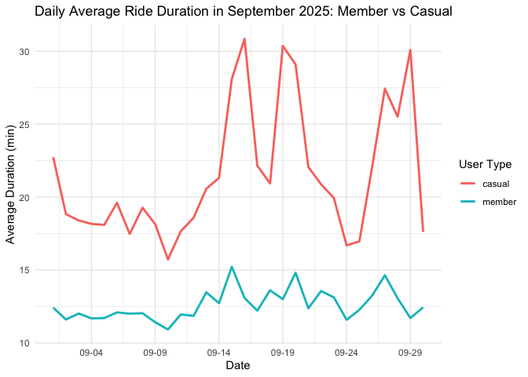<!-- -->

## 4.3 Day of week pattern

``` r
wday_daily <- bike %>%
  group_by(wday, user_type) %>%
  summarise(rides = n(), .groups = "drop") %>%
  mutate(wday = factor(wday, levels = c("Mon","Tue","Wed","Thu","Fri","Sat","Sun")))

p_wday <- ggplot(wday_daily, aes(x = wday, y = rides, fill = user_type)) +
  geom_col(position = "dodge") +
  labs(title = "Ridership by Day of Week (member vs casual)",
       x = "Day of Week", y = "Ride Count", fill = "User Type") +
  theme_minimal()

p_wday
```

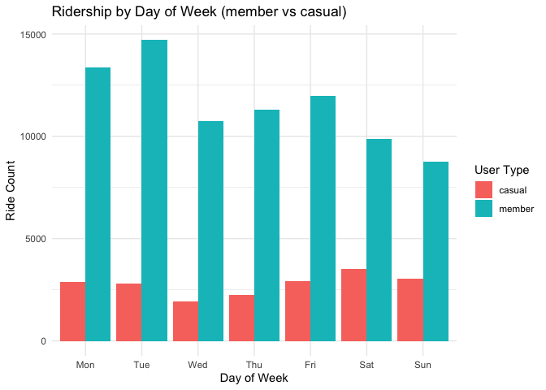<!-- -->

As shown in the bar chart, it is clear that member users have much
higher ride counts than casual users.

Specifically, member ride counts are particularly high on Mondays and
Tuesdays and reach their lowest on weekends.

In contrast, casual users’ ride counts are relatively consistent
throughout the week, with slightly higher numbers on weekends. The
observation confirms the previous conclusion.

``` r
p_dur_group <- bike %>%
  group_by(member_casual, weekend_and_holiday) %>%
  summarise(
    mean_duration = mean(ride_duration_hours, na.rm = TRUE)
  ) %>%
  ggplot(aes(x = weekend_and_holiday, y = mean_duration,
             fill = member_casual)) +
  geom_col(position = "dodge") +
  labs(title = "Average Ride Duration — Member vs Casual across Weekday/Weekend",
       x = "Day Type", y = "Duration (hours)") +
  theme_minimal()
```

    ## `summarise()` has grouped output by 'member_casual'. You can override using the
    ## `.groups` argument.

``` r
p_dur_group
```

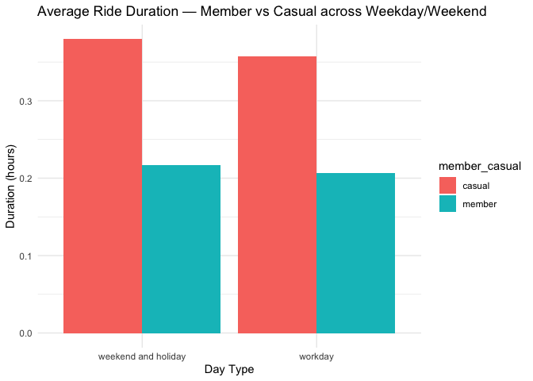<!-- -->

# 5. Time series of Average Ride Duration

``` r
dur_ts <- bike %>%
  group_by(start_date, member_casual) %>%
  summarise(mean_duration = mean(ride_duration_hours, na.rm = TRUE))
```

    ## `summarise()` has grouped output by 'start_date'. You can override using the
    ## `.groups` argument.

``` r
p_dur_ts <- ggplot(dur_ts, aes(start_date, mean_duration, color = member_casual)) +
  geom_line(size = 1) +
  labs(title = "Daily Average Ride Duration — Member vs Casual",
       x = "Date", y = "Duration (hours)") +
  theme_minimal()

p_dur_ts
```

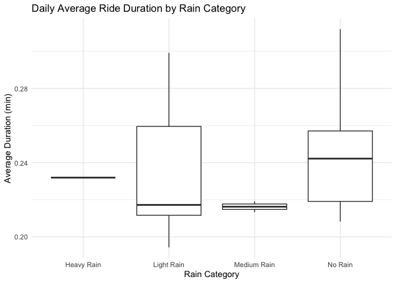<!-- -->

# 6. Weather effect

## 6.1 ride count vs temperature level category 这个图说明偏高温人们爱骑车

``` r
p_temp_level <- bike %>%
  group_by(start_date, temp_level_category) %>%
  summarise(rides = n()) %>%
  ggplot(aes(temp_level_category, rides)) +
  geom_boxplot() +
  labs(title = "Ride Counts by Temperature Level Category",
       x = "Temperature Category", y = "Daily Ride Count") +
  theme_minimal()
```

    ## `summarise()` has grouped output by 'start_date'. You can override using the
    ## `.groups` argument.

``` r
p_temp_level
```

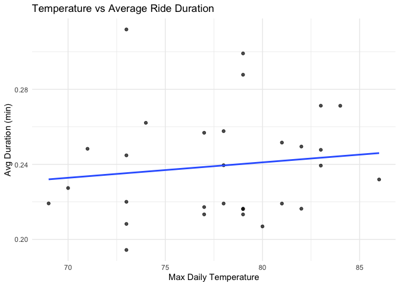<!-- -->

## 6.2 ride count vs rain category 这个图小雨在中雨和大雨中间，想办法调一下，除此之外至少能看出来下雨应该与骑行是负相关的

``` r
p_rain <- bike %>%
  group_by(start_date, rain_category) %>%
  summarise(rides = n()) %>%
  ggplot(aes(rain_category, rides)) +
  geom_boxplot() +
  labs(title = "Ride Counts by Rain Category",
       x = "Rain Category", y = "Daily Ride Count") +
  theme_minimal()
```

    ## `summarise()` has grouped output by 'start_date'. You can override using the
    ## `.groups` argument.

``` r
p_rain
```

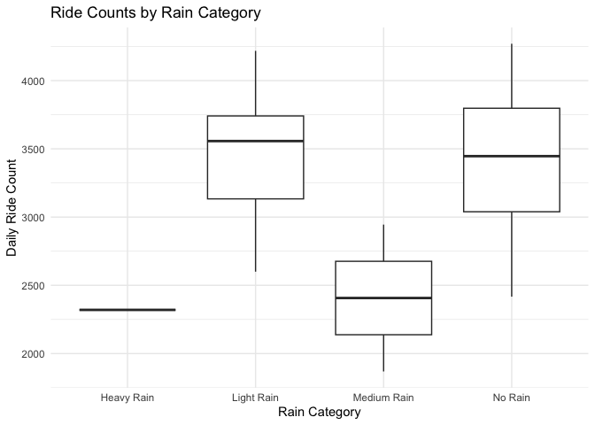<!-- -->

## 6.3 weather variables

``` r
# tmax
ggplot(daily, aes(x = tmax, y = total_rides)) +
  geom_point(alpha = .4) +
  geom_smooth(method = "loess") +
  labs(title = "Ride Count vs Daily Maximum Temperature",
       x = "tmax", y = "Rides") +
  theme_minimal()
```

    ## `geom_smooth()` using formula = 'y ~ x'

    ## Warning: Failed to fit group -1.
    ## Caused by error in `predLoess()`:
    ## ! workspace required (14996775205) is too large probably because of setting 'se = TRUE'.

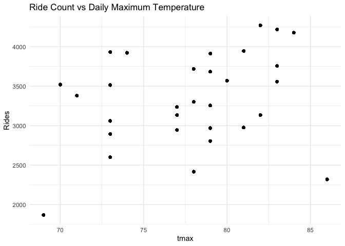<!-- -->

``` r
# prcp
ggplot(daily, aes(x = prcp, y = total_rides)) +
  geom_point(alpha = .4) +
  geom_smooth(method = "loess") +
  labs(title = "Ride Count vs Precipitation",
       x = "Precipitation (mm)", y = "Rides") +
  theme_minimal()
```

    ## `geom_smooth()` using formula = 'y ~ x'

    ## Warning in simpleLoess(y, x, w, span, degree = degree, parametric = parametric,
    ## : pseudoinverse used at -0.00505

    ## Warning in simpleLoess(y, x, w, span, degree = degree, parametric = parametric,
    ## : neighborhood radius 0.01505

    ## Warning in simpleLoess(y, x, w, span, degree = degree, parametric = parametric,
    ## : reciprocal condition number 7.1893e-25

    ## Warning in simpleLoess(y, x, w, span, degree = degree, parametric = parametric,
    ## : There are other near singularities as well. 0.0001

    ## Warning: Failed to fit group -1.
    ## Caused by error in `predLoess()`:
    ## ! workspace required (14996775205) is too large probably because of setting 'se = TRUE'.

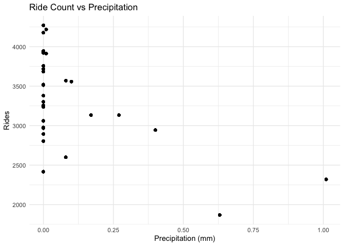<!-- -->

# 7 bike type

``` r
p_type <- bike %>%
  group_by(start_date, rideable_type) %>%
  summarise(rides = n()) %>%
  ggplot(aes(rideable_type, rides)) +
  geom_boxplot() +
  labs(title = "Ride Duration by Bike Type",
       x = "Bike Type", y = "Ride Counts") +
  theme_minimal()
```

    ## `summarise()` has grouped output by 'start_date'. You can override using the
    ## `.groups` argument.

``` r
p_type
```

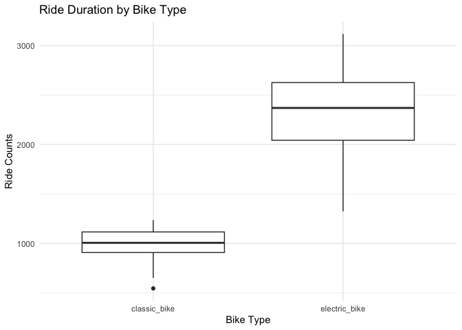<!-- -->

# 7 TSA 尝试做了下时间序列

``` r
library(tseries)
daily_rides <- bike %>%
  group_by(start_date) %>%
  summarise(total_rides = n(), .groups = "drop")

library(tsibble)
library(fable)

ts_data <- daily_rides %>%
  as_tsibble(index = start_date)

autoplot(ts_data, total_rides) +
  labs(title = "Daily Ride Counts",
       x = "Date",
       y = "Number of Rides")
```

<!-- -->

``` r
fit_arima <- ts_data %>%
  model(ARIMA(total_rides))

report(fit_arima)
```

    ## Series: total_rides 
    ## Model: ARIMA(0,1,1)(1,0,0)[7] 
    ## 
    ## Coefficients:
    ##           ma1    sar1
    ##       -0.4548  0.4685
    ## s.e.   0.1922  0.2006
    ## 
    ## sigma^2 estimated as 159701:  log likelihood=-214.82
    ## AIC=435.64   AICc=436.6   BIC=439.74

``` r
fc <- fit_arima %>% forecast(h = 7)

autoplot(fc, ts_data) +
  labs(title = "ARIMA Forecast of Daily Rides",
       x = "Date",
       y = "Number of Rides")
```

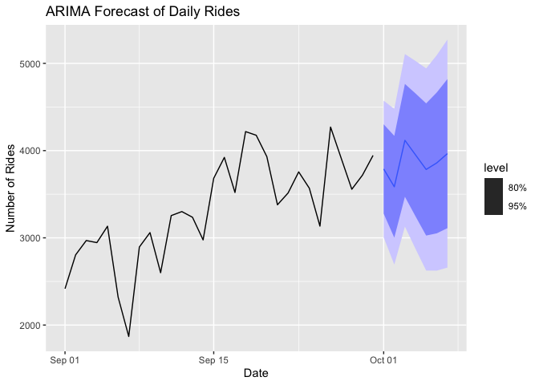<!-- -->

## 7.1 Decomposition 数据分解

``` r
fit_ets <- ts_data %>% model(ETS(total_rides))

components_plot <- autoplot(components(fit_ets)) +
  labs(
    title = "ETS Decomposition of Daily Ride Counts",
    subtitle = "Using Exponential Smoothing (suitable for short, non-periodic series)",
    x = "Date",
    y = "Value"
  ) +
  theme_minimal()

components_plot
```

    ## Warning: Removed 1 row containing missing values or values outside the scale range
    ## (`geom_line()`).

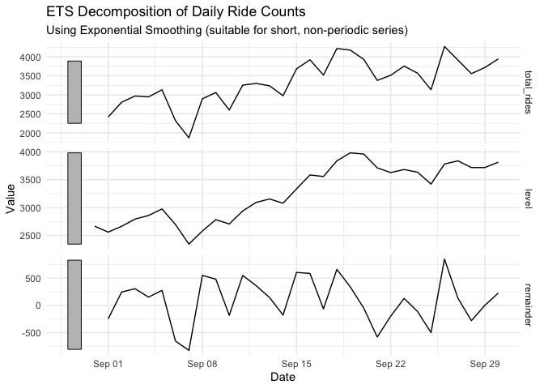<!-- -->

# 8 Summary

- Member and casual riders display distinct **daily and weekend/weekday
  patterns**.  
- Daily ride volume shows clear **temporal trends** across September.  
- Temperature and rainfall strongly shape both **trip volume**.  
- Time-series decomposition reveals trend + seasonality suitable for
  forecasting.
